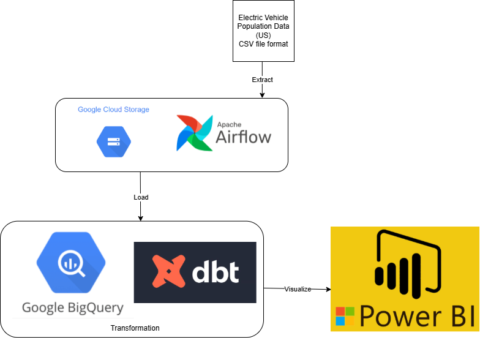

# EV_pipeline

- This is an initial project for creating a data pipeline using a publicly found dataset (https://catalog.data.gov/dataset/electric-vehicle-population-data).

- The project entails the flow of an ELT data pipeline doing the following:
      - Find large dataset; in this case in the form of a csv file
      - Take large dataset and load into GCS bucket
      - Extract the data utilizing Apache Airflow with a Python DAG in VS Code
      - Load respective DAG in to Google Composer; test to verify that data load correctly into Google BigQuery
      - Transform data using DBT cloud models that are published/built to Google BigQuery
      - Finally, the transformed data is then visualized in Power Bi

- The purpose of ths project is to see and understand the flow of how raw data is taken and presented into a dashboard that can then be used to make futture business decisions.

- Lessons learned and future plans:
      - Finding and giving the right grants and accesses so that these programs can all work together seamlessly; took longer than expected
      - Use multiple datasets that are similar and joining them in an ELT or ETL data pipeline
      - In future projects, work towards getting DAG query to run DBT model tasks; ETL vs. ELT
      - Use other types of open source database tool and apps 

ELT Data Pipeline Flow Chart

